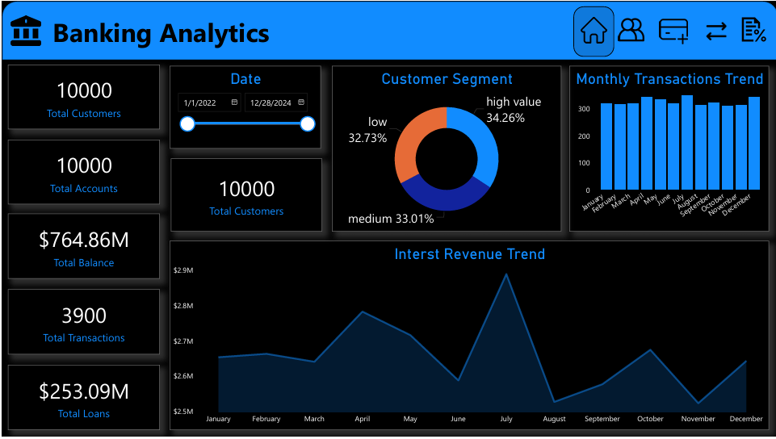
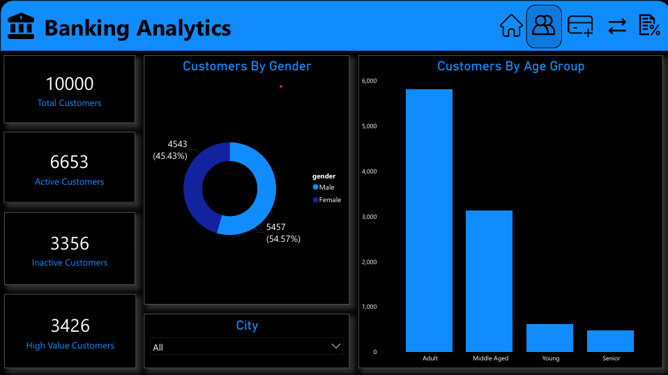
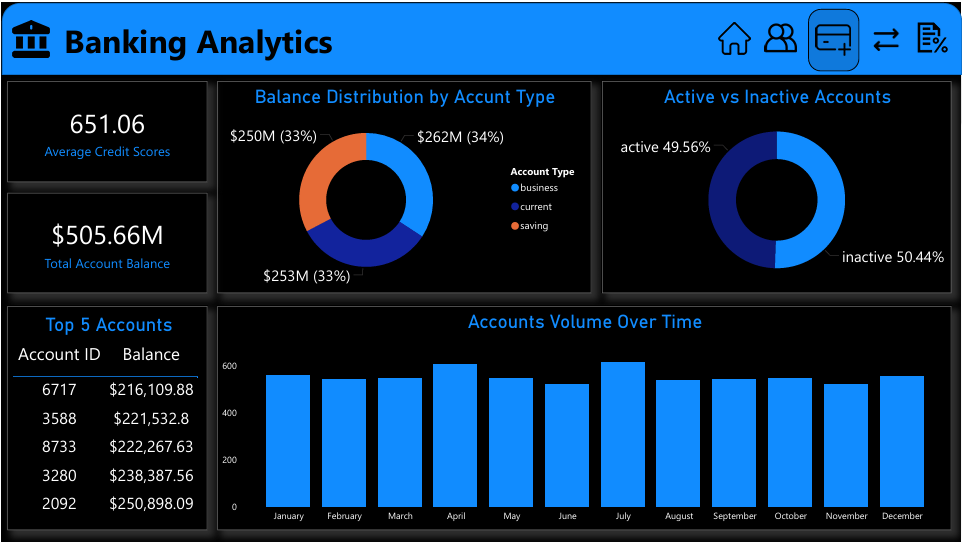
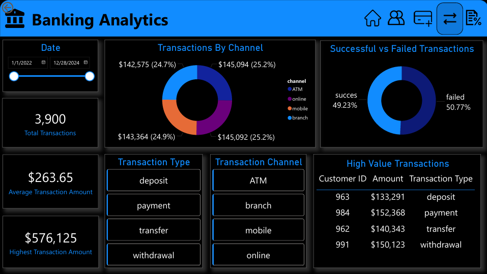
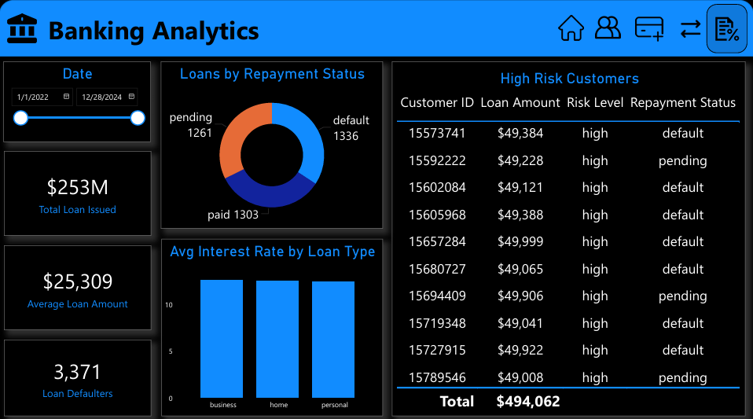

# Banking Analytics System

## Overview

The Banking Analytics Dashboard Project is a business intelligence project focused on analyzing banking operations, customer behavior, account performance, transaction activities, and loan insights using Excel and Power BI. The project aims to transform raw banking data into meaningful insights to support better business understanding and decision-making.

## Dataset

The project uses multiple CSV files containing banking-related data, including:

* Customers Data
* Accounts Data
* Transactions Data
* Loans Data
* Overview Metrics

The datasets were cleaned and prepared in Microsoft Excel before being imported into Power BI for analysis and visualization.

## Tools & Technologies

* Microsoft Excel
* Power BI

## Project Workflow

* Imported and cleaned datasets in Excel
* Removed duplicates and handled missing values
* Standardized and formatted data for analysis
* Created relationships and data models in Power BI
* Built interactive dashboards for different banking operations
* Generated business insights through visual analysis

## Dashboards

### Overview

Provides a high-level summary of the banking system including:

* Total Customers
* Total Accounts
* Total Transactions
* Total Loan Amount
* Overall Banking Performance

### Customers

Analyzes customer-related information such as:

* Customer Distribution
* Customer Segments
* Age and Gender Analysis
* Customer Growth Insights

### Accounts

Focuses on account-related analysis including:

* Account Types
* Account Status
* Balance Distribution
* Credit Score Analysis

### Transactions

Provides insights into transaction activities including:

* Transaction Trends
* Transaction Types
* Transaction Channels
* Successful vs Failed Transactions
* Average Transaction Amount

### Loans

Analyzes loan-related data including:

* Loan Distribution
* Repayment Status
* Risk Levels
* Interest Rate Analysis
* Loan Performance

## Key Insights

* Identified customer and account trends
* Analyzed transaction behavior and banking activity
* Evaluated loan performance and repayment patterns
* Monitored operational performance through interactive dashboards

## How to Run

* Download the project files
* Open the Power BI `.pbix` file in Power BI Desktop
* Ensure all CSV datasets are available in the correct file paths
* Refresh the data to load dashboards successfully

## Conclusion

This project demonstrates practical skills in data cleaning, business intelligence, dashboard development, and banking data analysis using Excel and Power BI. It highlights the ability to create clear and interactive dashboards for analyzing banking operations and customer insights.
